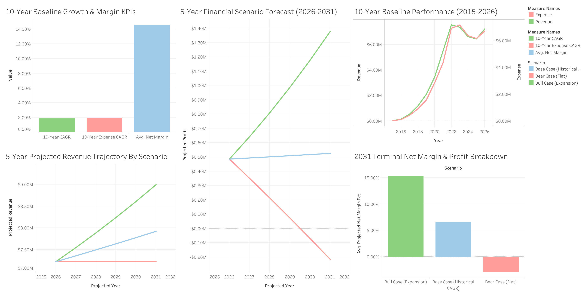
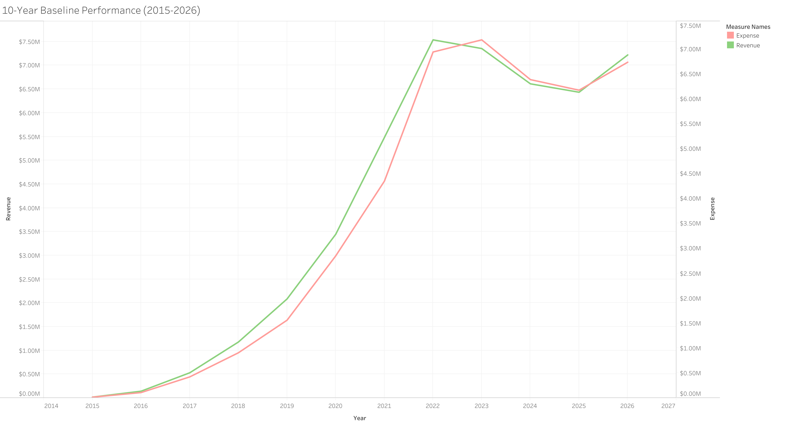
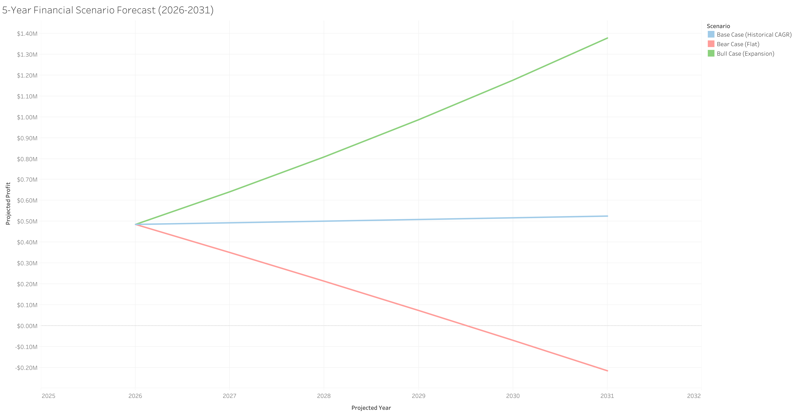
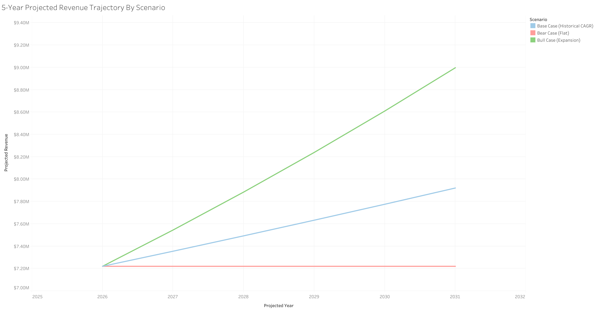

# M&A SME Financial Analysis: 10-Year Baseline & 5-Year Projections (2015–2031)

> 📊 **Interactive Dashboard:** [View Live on Tableau Public](https://public.tableau.com/app/profile/aiden.chen4958/viz/MAValuationFinancialForecast/Dashboard1?publish=yes)  
> 🛠️ **Tech Stack:** Excel (Data Preparation & Initial Profit Calculations), (SQL (Data Modeling & KPI Aggregation), Tableau Public (Data Visualization), GitHub (Documentation & Code Repository)

---

## Executive Summary

This project evaluates a small-medium-sized company's 10-year historical financial performance (2015-2025, including 2026 financial projections) and builds a 5-year, 3-scenario financial forecast model projecting performance through **2031**. 

Using **Microsoft Excel** for initial data and file formatting, and determining yearly profits, the raw dataset was structured and imported into **SQL** for KPI aggregation (CAGR, margin trends, and scenario modeling). The results were then visualized in **Tableau Public** to evaluate historical trajectories against three potential macroeconomic scenarios: **Bull Case (Expansion)**, **Base Case (Historical CAGR)**, and **Bear Case (Flat/Contracting)** alongside general visuals of the company's yearly KPIs.

---

## 1. Historical Baseline Analysis (2015–2025, including 2026 financial projections)

### Key Metrics & Trends
* **Revenue Trajectory:** Revenue grew significantly from **$17,182.92** in 2015 to a peak of **$7,537,182.68** in 2022, before normalizing around **$7.2M+** in 2026 (similar to 2024 and 2025).
* **Profitability Growth:** Profit reached **$1,133,926.91** in 2021 (a ~20.7% Net Margin).
* **Expense Drivers:** Operating expenses mirrored revenue growth closely, rising from **$15,118.11** (2015) to **$6,734,275.83** (2026).

### Historical KPIs (2015–2026)
* **10-Year Compound Annual Growth Rate (CAGR):** Demonstrates long-term historical top-line expansion.
* **10-Year Expense CAGR:** Highlights cost structure scalability alongside revenue expansion.
* **Average Net Margin %:** Reflects core operational efficiency across volatile market cycles (~14.2% historical average).

---

## 2. 5-Year Scenario Forecast Framework (2026–2031)

To model potential outcomes through **2031**, three strategic scenarios were established based on baseline performance and CAGR assumptions:

### Scenario (Modeling Methodology & Assumptions):
* **Bull Case (Expansion):** Assumes market expansion, margin improvement, & rev growth.
* **Base Case (Hist. CAGR):** Projects forward using historical baseline compound growth.
* **Bear Case (Flat):** Models stagnant revenue alongside sticky expense structures.

## Client Company Overview. Personal Data Analysis (by Aiden Chen)
* **Overall Business Health & Exit Timing:** While revenue expanded significantly from 2015 through 2022, operating expenses scaled by a near-identical amount. This parallel expense trajectory has eroded net profit margins in recent years, signaling underlying operational inefficiency. From an M&A or exit perspective, this margin compression presents a clear vulnerability—buyers and investors will heavily discount valuation due to unscaled overhead and volatile net profitability.
* **Recommendation:** Prior to pursuing an exit or capital raise, the company should pivot its focus from expansion to disciplined cost structure optimization. Management should target a concerted reduction in operating expenses over the next 3+ years to rebuild net profit margins, demonstrate consistent operating leverage, and establish a track record of predictable, quality earnings rather than unhedged top-line growth with equal expense increases.
